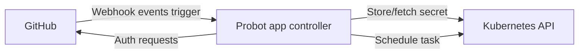

# Create Github applications with Probot and Tekton

## Context and Problem Statement

We want to create a generic GitHub bot factory that is workload agnostic, cloud native and easy to develop. Historically we've explored various options. This ADR should serve as a baseline for a number of bots which can share the same basic architecture and layout.

## Decision Drivers

* Bot is cloud-compatible, it is possible to easily deploy it on Kubernetes, it scales.
* Bot is primarily targeting GitHub integration.
* Bot is easy to develop. Developer experience matters, especially when integrating with third party services like GitHub. Decision outcome should make it easy for developers to work in sandbox diverse environments (partially) behind VPN.
* Release process is easy to streamline and gitopsify.

## Considered Options

* Tekton and Tekton Triggers
* Probot controller with Tekton
* Standalone Probot controller

## Decision Outcome

Chosen options: "Probot controller with Tekton".

### Positive Consequences

This is a hybrid solution of a controller service being developed as a cloud deployed application via Probot with a cloud native Tekton counterpart for heavy lifting.

Probot provides great GitHub integration capabilities and since it's developed as an application, it can be run both locally on developer machine as well as deployed to Kubernetes.

Tekton provides cloud native task execution environment, allowing on demand, potentially resource heavy computation within cloud allowing bot developer to use diverse external tools as external dependencies via containerized task runners - each task can pack and execute different containers.

Combination of a Probot application with Tekton allows great developer experience when the controller is easy to run locally while Tekton tasks can be scheduled to locally connected Kubernetes cluster which can be behind VPN.

### Negative Consequences

Application maintenance is effectively split between code (Probot controller source code) and configuration (Tekton task manifests). These needs to be kept in sync in task naming and parameters aspects. API changes (changing parameters, task names) needs to be coordinated when releasing.

## Pros and Cons of other Options

### Tekton and Tekton Triggers

* Good, because this option is fully cloud native meaning everything is orchestrated by Kuberentes and all handling is stored in Tekton manifests as configuration.
* Good, simple releasing/gating process since everything is configuration which can be managed by git ops.
* Bad, because fully cloud native solutions are complex to develop and debug. Since public GitHub interactions are primary target, development on private clusters behind VPN is not straightforward.
* Bad, because integrations are hard to test without complex infrastructure.

### Standalone Probot controller

* Good, because GitHub integration works out of the box.
* Good, because it's cloud compatible.
* Bad, because everything has to be bundled into a single container which limits integration capabilities with various external tools necessary for heavy lifting.
